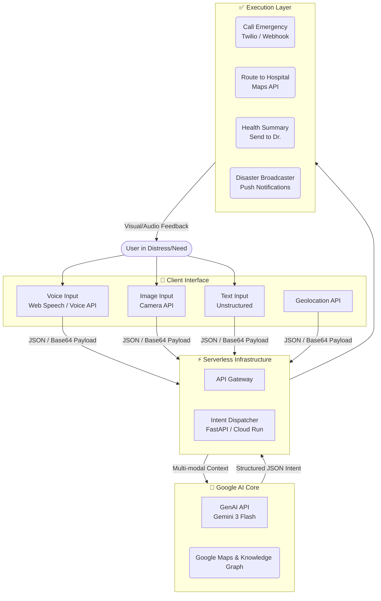
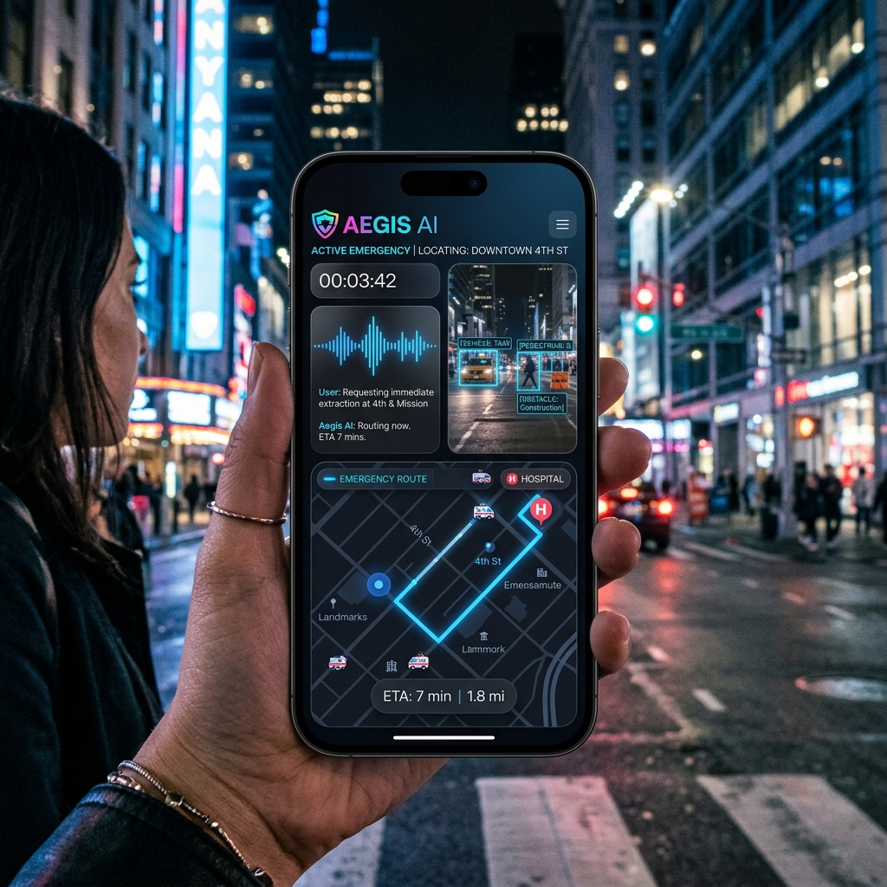

# 🛡️ Aegis AI: Universal Intent-to-Action Emergency Dispatcher


Aegis is a high-performance, multi-modal interface that bridges human intent with real-world action. Powered by Gemini, it processes voice, image, and text inputs to provide structured, verified, and life-saving responses in seconds.

---

## 🚀 Vision
In critical situations—emergency medical events, natural disasters, or high-urgency accidents—every second counts. **Aegis** eliminates the latency between "describing the problem" and "receiving the solution" by using advanced reasoning to dispatch multi-stage actions:
1.  **Voice to Intent**: Parses raw, unstructured speech for urgency and crucial data.
2.  **Vision to Metadata**: Analyzes images for hazards, victim status, or surroundings.
3.  **Action Dispatching**: Automatically suggests hospital routes, health reports for paramedics, and links to emergency contacts.

---

## 🏗️ System Architecture

Aegis flows from a sleek, interactive frontend through a serverless backend powered by Gemini’s multi-modal reasoning.



---

## 🔥 Key Features

-   **⚡ Near-Instant Processing**: Low-latency Gemini 3 Flash multimodal processing.
-   **👁️ Multimodal Vision**: Real-time image analysis for risk assessment.
-   **🛑 Rate Limiting & Security**: Built-in protection against API abuse and injection.
-   **💾 Persistence & Logs**: Real-time event logging to Firebase Firestore for responder dashboards.
-   **🌍 Edge Deployment**: Scalable to Google Cloud Run and Firebase Hosting.



---

## 🛠️ Tech Stack

### 🌀 Frontend
-   **Vite + React**: For an ultra-fast developer experience and production bundle.
-   **TypeScript**: Ensuring type safety across complex intent schemas.
-   **Vanilla CSS**: Custom design system with glassmorphism and motion.

### 🔌 Backend
-   **FastAPI**: Python-based asynchronous high-performance API.
-   **Gemini AI SDK**: Powering the vision-language reasoning core.
-   **Firebase Admin**: Managing logs and persistent state.

---

## 📦 Getting Started

### 1. Clone & Setup
```bash
git clone https://github.com/nikhil-shukla/hackathon_project.git
cd hackathon_project
```

### 2. Configure Environment
Create a `.env` file in the `backend/` directory:
```bash
GEMINI_API_KEY=YOUR_API_KEY
ALLOWED_ORIGINS=http://localhost:5173
GOOGLE_APPLICATION_CREDENTIALS=your-project-sa.json
```

### 3. Run Locally

**Backend (FastAPI):**
```bash
cd backend
pip install -r requirements.txt
python -m uvicorn main:app --reload
```

**Frontend (Vite):**
```bash
cd frontend
npm install
npm run dev
```

---

## 🚢 Deployment Detailed
For full deployment instructions (Google Cloud Run + Firebase Hosting), refer to [DEPLOYMENT.md](DEPLOYMENT.md).

---

## 📝 Roadmap
- [ ] **Twilio Integration**: Direct-to-dispatch automated calling.
- [ ] **Offline Mode**: Local caching of safety protocols.
- [ ] **Streaming Vision**: Support for real-time video stream analysis.

---

## 🛡️ License
MIT License. Built with ❤️ for the Hackathon by Nikhil Shukla.
