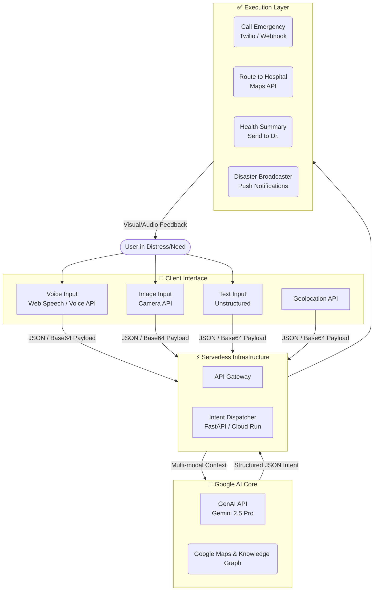

# Aegis AI: System Architecture

Aegis is a multi-modal, real-time intent-to-action dispatch system powered by Gemini AI. Here is the blueprint of how to scale it for production.

## Technology Stack

### Initial Prototype (Built)
* **Frontend**: React + Vite + Typescript (Vibrant UI, Lucide Icons)
* **Backend**: Python FastAPI (Uvicorn)
* **AI reasoning**: Google `google-genai` SDK using `gemini-2.5-pro`

### Production Roadmap (Google Cloud & Firebase)
* **Hosting**: Deploy Frontend via **Firebase Hosting**.
* **Compute**: Containerize the FastAPI backend and deploy to **Google Cloud Run**.
* **Database**: Log intents and actions using **Firestore** for real-time aggregation (helpful to build a dashboard for emergency responders).
* **Vision**: Migrate standard Image upload to streaming directly to Gemini Multimodal endpoints.

## Real-world Example (Heart Attack Scenario)
1. **Input**: "My father is sweating, chest pain, we are near a crowded road and traffic is bad..."
2. **Intent Parsing**: Gemini detects `Critical` urgency.
3. **Reasoning Extraction**: Extracts `symptoms = [sweating, chest pain]`, and infers possible myocardial infarction.
4. **Action Executed**:
   * Opens Google Maps immediately routing to the nearest active hospital avoiding traffic.
   * Prompts 1-tap call to 911.
   * Generates a "Doctor-Ready Report" that paramedics can read.
